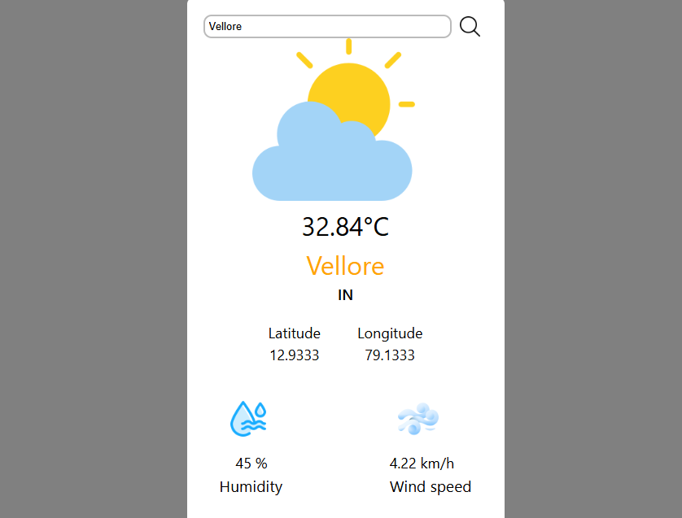

🌦️ React Weather App

A responsive weather application built with React.js that fetches real-time weather data from the OpenWeather API. Users can search for any city worldwide to get instant weather updates with temperature, humidity, wind speed, and weather conditions displayed in a clean and user-friendly UI.

🚀 Features

🌍 Search weather by city name

☁️ Displays temperature, humidity, and weather conditions

🌡️ Dynamic weather icons (clear, cloudy, rainy, etc.)

📱 Fully responsive design for mobile and desktop

⚡ Built with React Hooks

🛠️ Tech Stack

Frontend: React.js, CSS

API: OpenWeather API

Deployment: Netlify

📸 Screenshots

⚙️ Installation & Setup

Clone the repo

git clone https://github.com/your-username/React-weather-project.git
cd React-weather-project

Install dependencies

npm install

Add your OpenWeather API key in your code
Example:

const API_KEY = "YOUR_API_KEY";

Run the app

npm start

Build for production

npm run build

🌐 Live Demo

